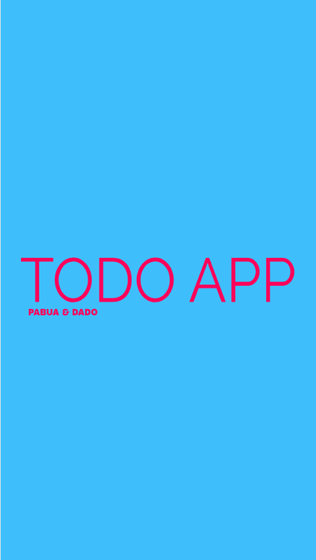
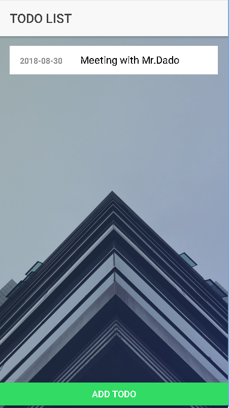
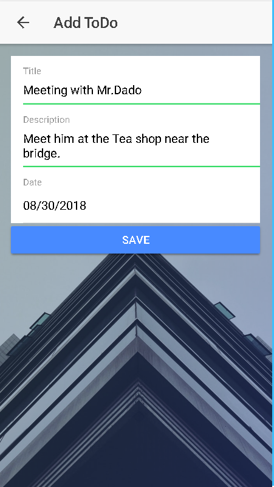
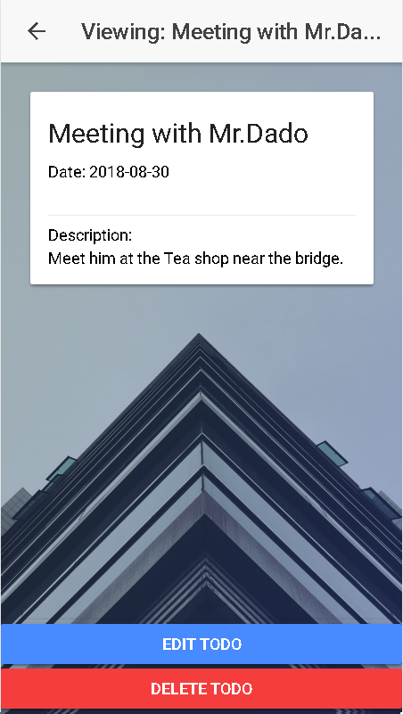
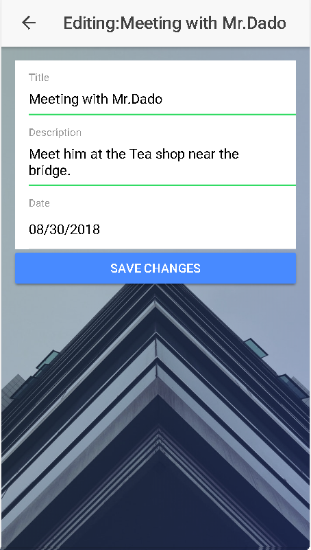

# My ToDo Repo

This repo is a submission for assignment in IT Elective 2

## Getting Started

These instructions will get you a copy of the project up and running on your local machine for development and testing purposes.

### Prerequisites

Install Ionic version 3.19.0 to avoid errors.

```
>npm install -g ionic@3.19.0 cordova@8.0.0
```

open command line in the directory and serve it locally

```
>cd Desktop/MyRepo
>ionic serve
```

Command Line will ask just input Y to install dependencies: 

```
Looks like a fresh checkout! No ./node_modules directory found. 
Would you like to install project dependencies? (Y/n) Y

```

## Main Features

* Splashscreen
* Display all To Do (READ)
* Add To Do (CREATE)
* Edit To Do (UPDATE)
* Delete To Do (DELETE)

## Sample Images
  




## Built With

* [Ionic Framework](https://ionicframework.com/) - The web framework used

## Authors

* **Cavin Pabua** -  - [Cavin12400](https://github.com/cavin12400)
* **Marc Dado** -  - [MarcDado](https://www.facebook.com/profile.php?id=100000009198150)

